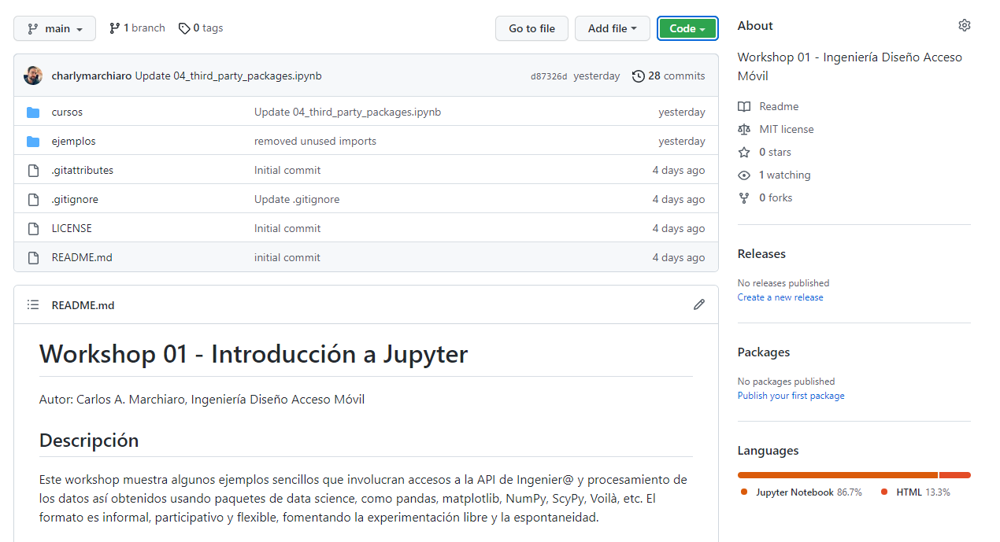
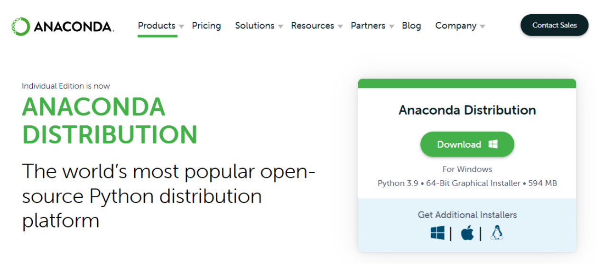
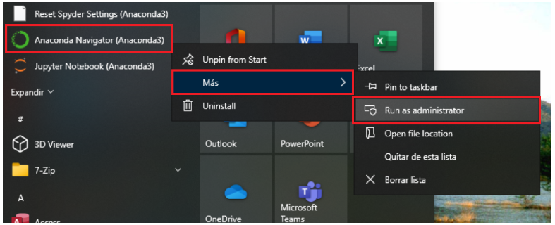
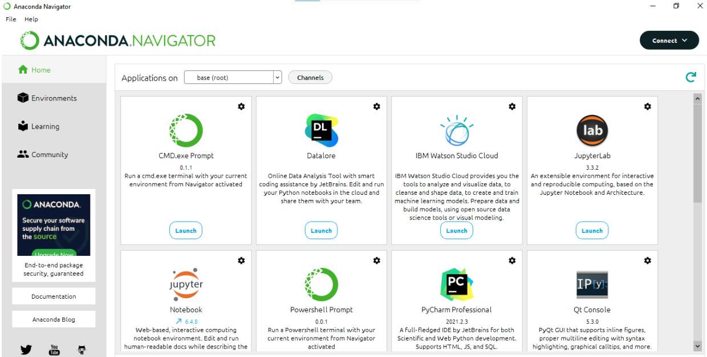
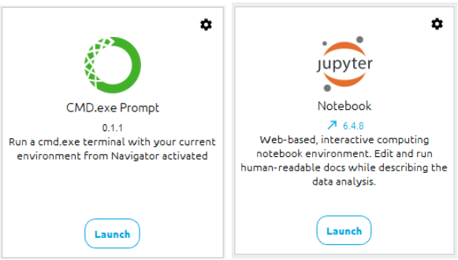
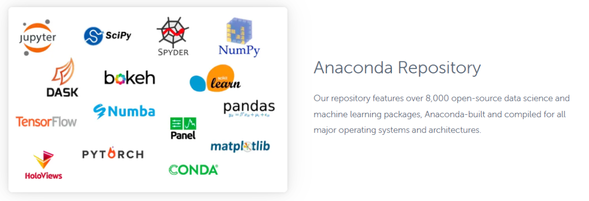
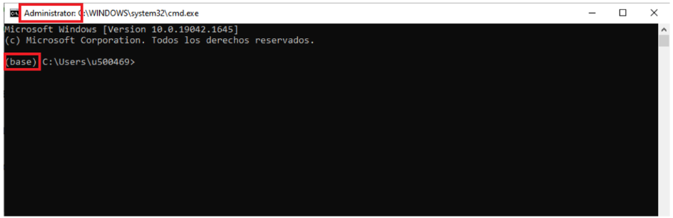
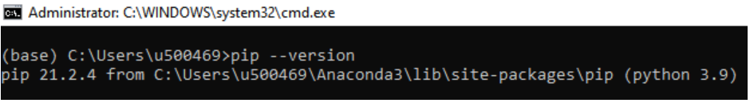
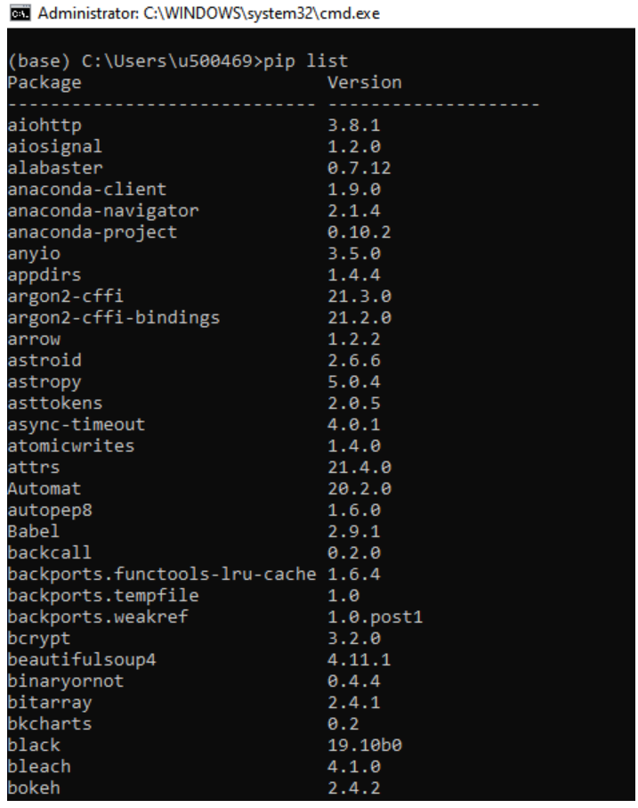
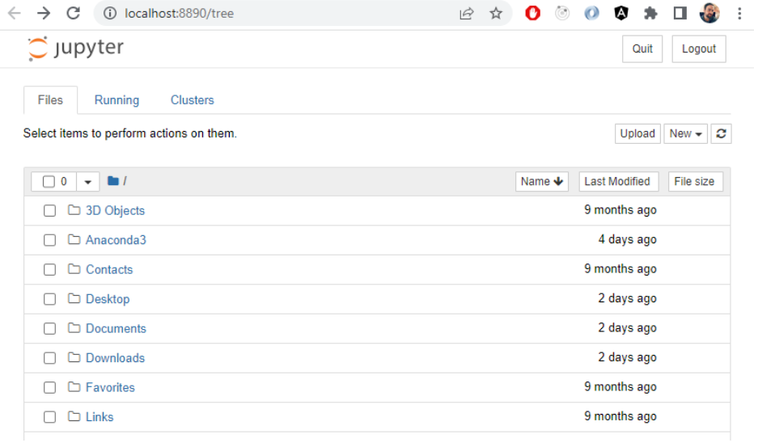

# Contenidos del Workshop

---

> ## Descargar material y ejemplos

Los contenidos del Workshop están disponibles en un repositorio de GitHub:

[charlymarchiaro/workshop-tp-01](https://github.com/charlymarchiaro/workshop-tp-01)

Se seguirán agregando nuevos ejemplos y materiales. Para descargar la versión más actualizada como zip, ir al siguiente link:

[Download ZIP](https://github.com/charlymarchiaro/workshop-tp-01/archive/refs/heads/main.zip)

Para evitar problemas más adelante, extraer los contenidos del archivo zip dentro de la carpeta **Documentos** de Windows.

# Instalación de Jupyter

---

> ## Método 1: Usando la distribución Anaconda

---
1. Ir a este link y descargar el instalador de la versión gratuita de Anaconda (~600 MB):
https://www.anaconda.com/products/distribution

---
2. Una vez instalado, ejecutar el Anaconda Navigator, **siempre como administrador**:

---
3. Al abrirlo aparecen distintas aplicaciones incluidas:

En este instructivo nos interesan dos: **CMD.exe Prompt** y **jupyter Notebook** (no confundir con JupyterLab).

---
4. Con Anaconda se instala la última versión del lenguaje Python, junto con algunos paquetes o *«librerías»* de uso frecuente:

---
5. Antes de empezar con jupyter, veamos qué paquetes se instalaron y cómo agregar nuevos.

> Abrimos el CMD.exe Prompt. Es una ventana de consola de Windows normal, pero al ejecutarla desde el Anaconda Navigator hay dos diferencias importantes:
> - En el título aparece como Administrator, por haber ejecutado el Anaconda Navigator como administrador. Esto es importante para poder instalar paquetes.
> - A la izquierda del prompt aparece (base), que significa que estamos dentro de un entorno virtual de python. Base es el entorno por defecto que instala Anaconda, pero en el futuro pueden haber distintos entornos en la misma PC, cada uno con diferentes paquetes. Por ahora trabajemos en el base.

Vamos a usar el programa pip que es el gestor de paquetes de Python.
Si ejecutamos:

    pip --version

Vemos la versión de Python, que en este caso es 3.9

Si queremos listar los paquetes ya instalados en nuestro entorno base, podemos ejecutar:

    pip list

Vamos a necesitar algunos paquetes más, podemos instalarlos con el comando **pip install**.
Queremos instalar dos paquetes muy interesantes que son [seaborn](https://seaborn.pydata.org/) y [plotly](https://plotly.com/)

Con pip es muy sencillo, basta con ejecutar estos dos comandos:

    pip install seaborn
    pip install plotly

Otros paquetes pueden instalarse en cualquier momento más adelante.

6. Finalmente ejecutamos jupyter Notebook desde el navigator.

Buscar dentro de **Documentos** los contenidos y abrir las notebooks (archivos .ipynb) para trabajar.
